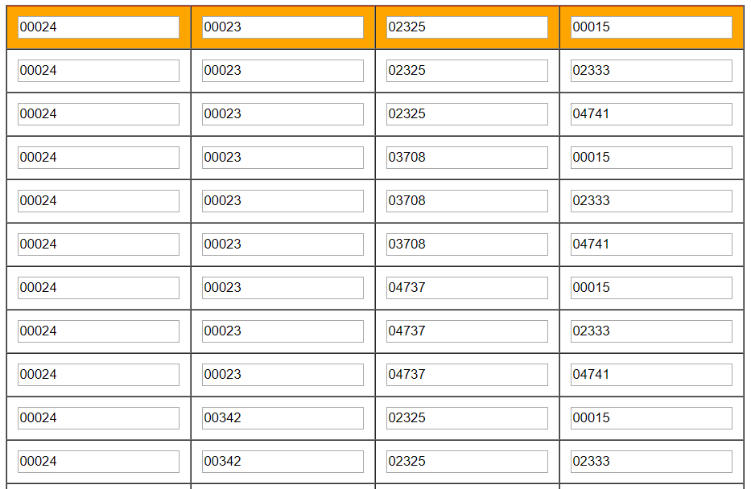

离的近的县区，自考报考的科目满了，自己需要尝试不同的组合，但是不清楚哪个组合是否试过了，所以写个程序记录一下


目前的效果图是:




尝试过使用油猴脚本，固定死 选中的 县区(提示的错误消息是alert，县区和报考的科目的都得重新输入一遍)

```
// ==UserScript==
// @name         zikao baokao
// @namespace    http://tampermonkey.net/
// @version      0.1
// @description  try to take over the world!
// @author       You
// @match        http://chromecj.com/web-development/2018-07/1468.html
// @grant        none
// @include     http://www.stegd.edu.cn/selfec/index.html
// @match http://www.stegd.edu.cn/selfec/*
// @require https://cdn.bootcss.com/jquery/2.2.1/jquery.min.js
// ==/UserScript==

(function() {
    'use strict';
    var try_index = 0;
    var area = ['0303','0304','0305','0306','0307','0308','0309','0310','0311','2001'];
    //for(var i = 0;i < area.length;i++){

    //}
    $("#ksxq").val('0105');
     console.log(window.location);
})();
```

最后选择的是 江门新会区才报考成功,离sz 176公里,哭 :cry: